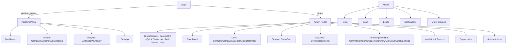

# Navigation Blueprint (Stage 5.9 Phase 2)

The pre-implementation architecture for the Phase 2 Navigation & IA modernization. Governs both web portals and the employee mobile app. **No API, RBAC, business-logic, or tenant-isolation changes** — this is a pure presentation-layer restructuring; every existing route keeps working.

## 1. Problems being solved (from the Phase 1 audit)

- Company Admin sidebar: **32 flat items**, no grouping, AI features scattered across 7 entries, org features across 5.
- No global header: theme toggle buried in the sidebar footer, notifications only reachable as a sidebar item, no global search, no quick-create.
- Every page statically imported → one large JS bundle, slow first paint.
- Mobile: "More" screen is a flat list of 14 links; leads (a core employee task) is not a tab; notifications have no surface.

## 2. Web sidebar hierarchy (sitemap)

Grouped, collapsible sections. The active route's group auto-expands; expansion state persists per portal in `localStorage` (`csp_nav_admin` / `csp_nav_platform`). Items are **permission-filtered before render** using the exact same gates that exist today (no gate is added, removed, or loosened; a group with zero visible items does not render).

### Company Admin portal (`/admin`)

| Group | Items (route unchanged) | Visibility gate (existing) |
|---|---|---|
| — | Dashboard `/admin` | all |
| CRM | Contacts, Companies, Leads Pipeline, Duplicates, Tags | all |
| Capture | Scan Card `/admin/scan` | all |
| Activities | Events, Documents | Documents: `canViewDocuments` |
| AI Intelligence | AI Command Center, AI Insights, Sales Copilot, Workflow Intelligence, Executive Intelligence, Batch AI, AI Settings (`/admin/ai`) | AI Command: `canViewAssistant`; Executive: `canViewExecutive`; others as today |
| Analytics & Reports | Reports, Executive Dashboard (`/admin/analytics`) | as today |
| Organization | Team, Departments, Teams, Employee Directory, Org Hierarchy, Roles & Permissions | as today |
| Administration | Organization Profile (`/admin/organization`), Pipeline Settings, Security, Subscription, Sessions, Settings | as today |

Notifications and My Profile leave the sidebar → header (bell + user menu). Their routes remain valid.

### Platform Owner portal (`/platform`)

| Group | Items |
|---|---|
| — | Dashboard |
| Tenants | Companies, Users, Subscriptions |
| Insights | Analytics, AI Intelligence, Activity |
| Administration | Settings |

## 3. AI Intelligence Hub

All seven AI surfaces live under one "AI Intelligence" group so AI reads as one platform. Routes, RBAC modules, and page internals are untouched; only grouping/order/icons change.

## 4. Global header

One `AppHeader` component mounted in both portal layouts (sticky, `h-14`, `bg-card border-b`):

| Slot | Behavior |
|---|---|
| Search field (center-left) | Read-only trigger; opens the command palette. Shows `⌘K` hint. |
| Quick Create (+) | Dropdown: New Contact, New Lead (dialog on `/admin/leads`), New Event, Scan Card — permission-filtered like the sidebar. |
| AI shortcut (sparkles) | Jumps to AI Command Center (`canViewAssistant`) or Sales Copilot fallback. |
| Notifications (bell) | Unread badge via existing `useGetUnreadCount`; links to `/admin/notifications`. Platform portal: hidden (no notifications API surface for platform_owner today — nothing is faked). |
| Theme toggle | Existing `ThemeToggle` (moves from sidebar footer to header). |
| User menu (avatar) | Name/email/role, My Profile, Settings, Sign out. |
| Language switch | **Deferred**: the web app has no i18n runtime (mobile is EN/AR). Shipping a web language switch requires web i18n infrastructure — scheduled with screen modernization, not faked in Phase 2. |

## 5. Global command palette

`cmdk` dialog (existing shadcn `command.tsx`), opened by **⌘K / Ctrl+K** or the header search field.

Sections: **Recent** (last 8 visited records, `localStorage csp_recent`), **Navigation** (permission-filtered sidebar items), **Quick create**, **AI actions** (Ask AI Command Center, Open Sales Copilot, …), **Records** (live contact search via the existing `GET /contacts?search=` endpoint, debounced 250 ms, top 6; the leads list API has no free-text search parameter today, so lead search is deferred rather than faked client-side). Full keyboard navigation; results announce via cmdk's built-in listbox ARIA.

## 6. Mobile navigation (sitemap)

Bottom tabs (per approved strategy): **Home · Scan · Leads · Notifications · More**

- Scan = existing capture hub (renamed label; same screen/flows).
- Leads = existing leads screen promoted into a tab.
- Notifications = **new list screen** consuming the *existing* `GET /notifications` + unread-count + mark-read endpoints (already in the generated client). Tab badge = unread count.
- Contacts and Follow-ups move into More (existing screens; unchanged routes).

**More** becomes grouped:

| Group | Items |
|---|---|
| Communications | Reserved tile, disabled "Coming in Stage 5.5" (explicitly per directive; not a fake link) |
| CRM | Contacts, Companies, Leads Pipeline, Follow-ups, Meetings, Tasks, Events, Duplicates |
| AI Intelligence | AI Assistant, Workflow, Executive Intelligence |
| My Workspace | Digital Card, My Numbers, Sync |
| Settings | Settings |

Documents/Reports mobile screens do not exist today; they are Phase 3+ scope and are not added as dead links. EN/AR strings for every new/renamed label; RTL via the existing `useLocale` helpers.

## 7. Permission matrix (navigation surfaces)

| Surface | platform_owner | primary_admin | admin | employee |
|---|---|---|---|---|
| Platform portal | ✅ | — | — | — |
| Admin sidebar core (CRM/Capture/Events/Org/Admin groups) | per existing router guard | ✅ | ✅ (writes per matrix) | per permissions |
| Documents | per `canViewDocuments` | ✅ | `documents:view` | `documents:view` |
| AI Command Center | ❌ (existing gate) | ✅ | `ai_assistant:view` | `ai_assistant:view` |
| Executive Intelligence | ❌ (existing gate) | ✅ | `ai_executive:view` | `ai_executive:view` |
| Reports | ❌ | ✅ | default-on | opt-in |
| Quick Create entries | mirror the create-permission of the target entity (existing checks) | | | |

The nav layer only *reads* these gates — the same booleans the current sidebar computes. Server-side enforcement is untouched.

## 8. IA diagram

## 9. Performance & accessibility commitments

- All portal pages converted to `React.lazy` + route-level `Suspense` skeleton → smaller initial bundle, instant-feeling shell.
- Sidebar groups: `<nav aria-label>`, buttons with `aria-expanded`/`aria-controls`, chevron rotation honors reduced motion.
- Header controls: all real buttons with `aria-label`s; bell badge has text alternative; palette is a labeled dialog with focus trap (cmdk/radix built-in).
- Mobile: 44pt targets, `accessibilityLabel` on tab items, RTL-safe layouts.

## 10. Naming standardization

"Executive Dashboard" (analytics page) vs "Executive Intelligence" (AI) kept distinct but co-grouped correctly; "AI Intelligence" (`/admin/ai`) relabeled **AI Settings** (it is the provider-settings page — name now says what it does). All icons single-purpose (no more Bot/Sparkles/LineChart double-use).
